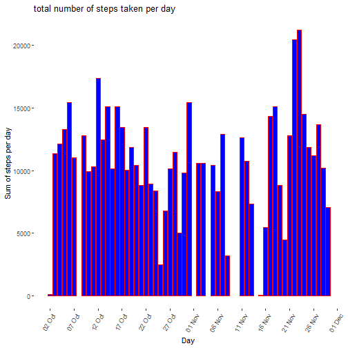
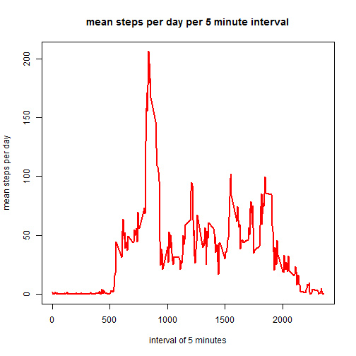
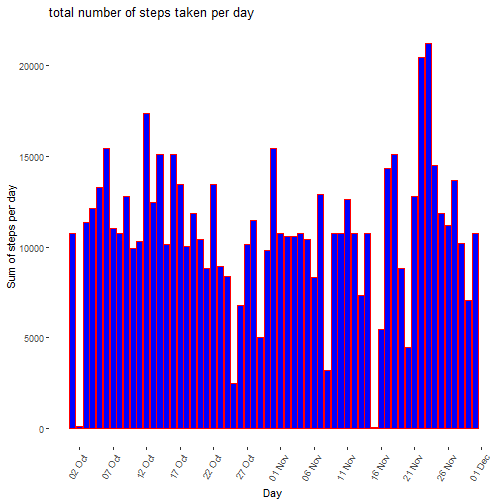
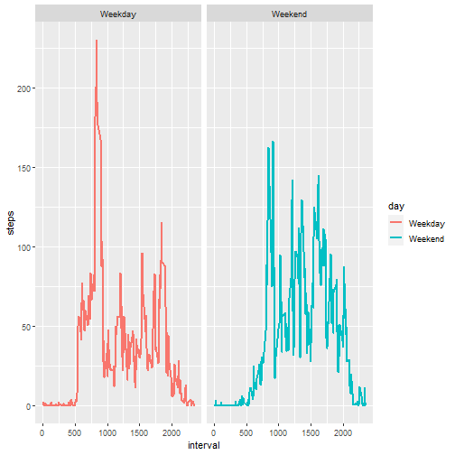

## Loading dependency and loading the activity.csv file
Modifying the structure of date column in a

```r
library(tidyverse)
a<-read.csv("./activity.csv", sep=",", header = T)
a$date<-as.Date(a$date)
```
## What is mean total number of steps taken per day?

### Calculate the total number of steps taken per day

```r
b<-a%>%group_by(date)%>%filter(is.na(steps)!=T)%>%summarize(sum_steps_day=sum(steps,na.rm = T))
```

```
## `summarise()` ungrouping output (override with `.groups` argument)
```

```r
head(b,10)
```

```
## # A tibble: 10 x 2
##    date       sum_steps_day
##    <date>             <int>
##  1 2012-10-02           126
##  2 2012-10-03         11352
##  3 2012-10-04         12116
##  4 2012-10-05         13294
##  5 2012-10-06         15420
##  6 2012-10-07         11015
##  7 2012-10-09         12811
##  8 2012-10-10          9900
##  9 2012-10-11         10304
## 10 2012-10-12         17382
```

### Make a histogram of the total number of steps taken each day

```r
ggplot(b, aes(x=date, y=sum_steps_day))+
  geom_histogram(stat="identity", fill="blue",col="red",binwidth=30, width=NULL)+
  scale_x_date(date_breaks = "5 days", date_labels =  "%d %b")+
  theme(axis.text.x=element_text(angle=60, hjust=1), panel.grid = element_blank(), panel.background = element_blank())+
  xlab("Day") + 
  ylab("Sum of steps per day") + 
  ggtitle("total number of steps taken per day")
```

```
## Warning: Ignoring unknown parameters: binwidth, bins, pad
```


### Calculate and report the mean and median of the total number of steps taken per day

```r
summary(b$sum_steps_day)
```

```
##    Min. 1st Qu.  Median    Mean 3rd Qu.    Max. 
##      41    8841   10765   10766   13294   21194
```
## What is the average daily activity pattern?

### Make a time series plot (i.e.type = "l") of the 5-minute interval (x-axis) and the average number of steps taken, averaged across all days (y-axis)

```r
c<-a%>%group_by(interval)%>%filter(is.na(steps)!=T)%>%summarize(mean_steps_day=mean(steps,na.rm = T))
```

```
## `summarise()` ungrouping output (override with `.groups` argument)
```


```r
plot(x=c$interval, y=c$mean_steps_day, type="l", lwd=2,col="red",ylab = "mean steps per day", xlab="interval of 5 minutes", main="mean steps per day per 5 minute interval")
```



### Which 5-minute interval, on average across all the days in the dataset, contains the maximum number of steps?

```r
e<-c[which.max(c$mean_steps_day),]
paste("The maxinum number of mean step is in the interval", e[1,1], "and the mean step during that interval is", e[1,2])
```

```
## [1] "The maxinum number of mean step is in the interval 835 and the mean step during that interval is 206.169811320755"
```

## Imputing missing values
### Calculate and report the total number of missing values in the dataset (i.e. the total number of rows)

```r
sum(is.na(a$steps))
```

```
## [1] 2304
```
### Choosing the mean of 5 minute interval and replacing them
### Create a new dataset that is equal to the original dataset but with the missing data filled in.

```r
newa<-a
for (i in 1:nrow(newa)) {
  if(is.na(newa$steps[i])) {
    meansperinterval <- round(c$mean_steps_day[which(c$interval == newa$interval[i])])
    newa$steps[i] <- meansperinterval
  }
}
```

### Make a histogram of the total number of steps taken each day and Calculate and report the mean and median total number of steps taken per day. Do these values differ from the estimates from the first part of the assignment? What is the impact of imputing missing data on the estimates of the total daily number of steps?
The imputing increases the overall mean of the data set
It also places numerous bias

```r
sum(is.na(newa$steps))
```

```
## [1] 0
```

```r
f<-newa%>%group_by(date)%>%summarize(sum_steps_day=sum(steps,na.rm = T))
```

```
## `summarise()` ungrouping output (override with `.groups` argument)
```

```r
ggplot(f, aes(x=date, y=sum_steps_day))+
  geom_histogram(stat="identity", fill="blue",col="red")+
  scale_x_date(date_breaks = "5 days", date_labels =  "%d %b")+
  theme(axis.text.x=element_text(angle=60, hjust=1), panel.grid = element_blank(), panel.background = element_blank())+
  xlab("Day") + 
  ylab("Sum of steps per day") + 
  ggtitle("total number of steps taken per day")
```

```
## Warning: Ignoring unknown parameters: binwidth, bins, pad
```


Reporting the mean of the new dataset

```r
summary(f$sum_steps_day)
```

```
##    Min. 1st Qu.  Median    Mean 3rd Qu.    Max. 
##      41    9819   10762   10766   12811   21194
```

## Are there differences in activity patterns between weekdays and weekends?
### Create a new factor variable in the dataset with two levels – “weekday” and “weekend” indicating whether a given date is a weekday or weekend day.

```r
newa$day<-ifelse(weekdays(newa$date)=="Saturday"|weekdays(newa$date)=="Sunday", "Weekend", "Weekday")
```

```r
date<-aggregate(steps ~ interval+day, newa, mean)
head(date)
```

```
##   interval     day      steps
## 1        0 Weekday 2.28888889
## 2        5 Weekday 0.40000000
## 3       10 Weekday 0.15555556
## 4       15 Weekday 0.17777778
## 5       20 Weekday 0.08888889
## 6       25 Weekday 1.57777778
```

### Make a panel plot containing a time series plot (type = "l") of the 5-minute interval (x-axis) and the average number of steps taken, averaged across all weekday days or weekend days (y-axis). See the README file in the GitHub repository to see an example of what this plot should look like using simulated data.


```r
ggplot(date, aes(x=interval, y=steps))+geom_line(size=0.75,aes(col=day))+facet_wrap(.~day)
```


